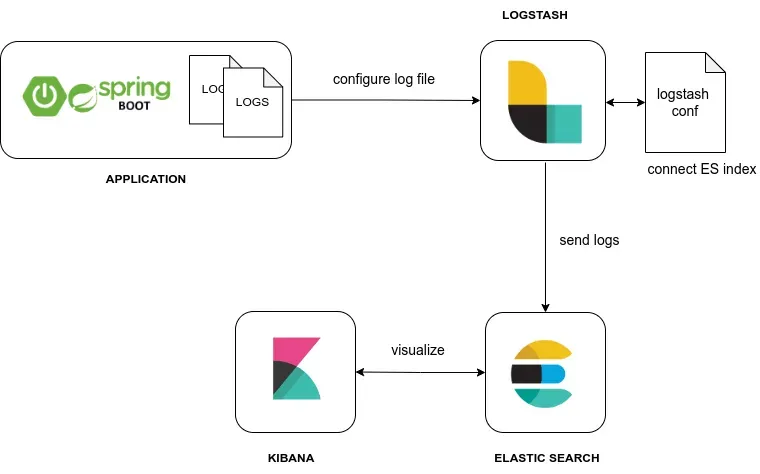
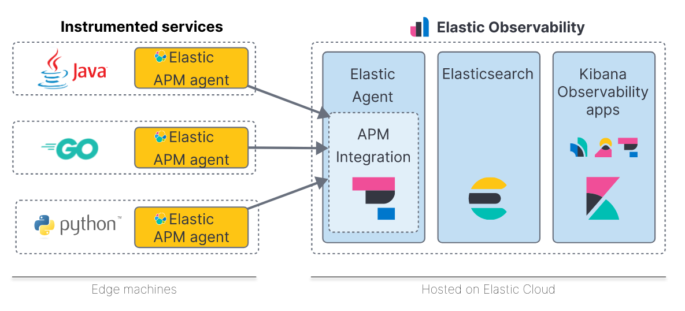
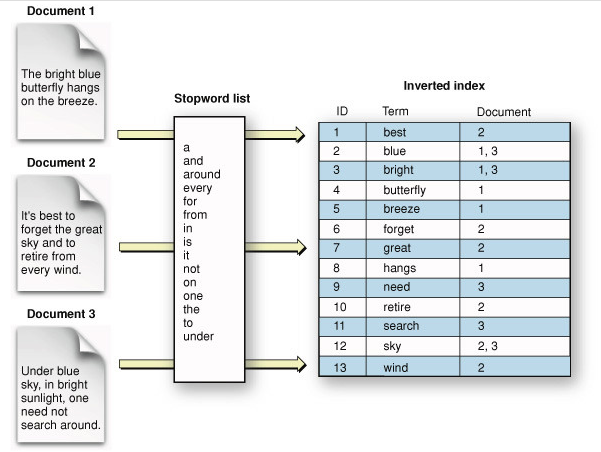

# SpringBoot ELK Sample

---

## ELK를 통한 Log 수집 및 로그 시각화



> - ./script 디렉토리 docker-compose-es-logstash-kibana.yml 파일을 docker-compose 명령을 통해 실행
> - elasticsearch / logstash / kibana 서비스간의 네트워크 설정은 docker bridge network 사용하도록 설정
> - elasticsearch 8.x 버전의 경우 default로 인증 설정값이 true로 기동되지만 테스트를 위해 false 처리 (xpack.security.enabled=false)
> - docker image 생성 시 logstash.conf 파일을 통해 input/filter/output 설정 추가

---

## APM (Application Performance monitoring)



> - elasticsearch 서비스와 함께 apm metric을 수집하는 server 역할의 서비스 기동 필요
> - ./script 디렉토리 docker-compose-es-logstash-kibana.yml 파일에 apm-server 항목을 통해 docker-compose 구성
> - metric 데이터를 전송할 client 모듈은 elasticsearch 공식 사이트에서 각 언어에 맞는 agent를 제공
> - springboot의 경우 ./apm-agent 디렉토리의 elastic-apm-agent-1.51.0.jar 라이브러리를 사용하여 기동

```text
// JVM Option 추가 
    -javaagent:./apm-agent/elastic-apm-agent-1.51.0.jar 
        -Delastic.apm.server_urls=http://localhost:8200 
        -Delastic.apm.service_name=boot-apm-agent 
        -Delastic.apm.application_packages=com.example 
        -Delastic.apm.environment=dev 
        -Dspring.profiles.active=dev
```

## 검색엔진



> - elasticsearch index에 데이터를 원하는 키워드로 검색 가능
> - elasticsearch는 데이터를 역색인하여 index에 저장
> - 역색인 작업을 위한 데이터에 대해 형태소 분석 후 keyword 단위로 추출하여 index에 저장
> - 한글의 경우 형태소 분석을 위해 아리랑(arirang), 은전한닢(seunjeon), 노리(nori) 형태소 분석기를 제공
> - 노리 형태소 분석기가 표준처럼 사용되고 있으며 노리를 사용하기 위해서는 elasticsearch 기동 후 별도의 플러그인을 추가해야 한다.
```text
    // elasticsearch 서버 접속 후 아래 명령어를 통해 nori 형태소 분석기 추가
    bin/elasticsearch-plugin install analysis-nori
```

> - index 생성 시 nori 형태소 분석기를 사용한다고 설정해야 하며 이때 다양한 filter를 설정해서 원하는 검색엔진 최적화 가능
> - index 생성 시 shards와 replicas 옵션을 통해 원하는 갯수로 설정이 가능 (shards는 생성 시점에만 설정 가능, replicas는 운영중에 변경도 가능)
> - elasticsearch index는 rdb와 다르게 json 포맷을 통해 구성이 가능하고 필드명에 한글과 같은 문자열도 사용 가능
```text
    PUT http://localhost:9200/movie
    {
      "settings": {
        "number_of_shards": 2,
        "number_of_replicas": 0,
        "index": {
          "analysis": {
            "tokenizer": {
              "nori_tokenizer_mixed": {
                "type": "nori_tokenizer",
                "decompound_mode": "mixed"
              }
            },
            "analyzer": {
              "korean": {
                "tokenizer": "nori_tokenizer_mixed",
                "type": "custom",
                "filter": ["nori_readingform", "lowercase", "nori_part_of_speech_basic", "snowball"]
              }
            },
            "filter": {
              "nori_part_of_speech_basic": {
                "type" : "nori_part_of_speech",
                "stoptags" : [
                  "E",
                  "IC",
                  "J",
                  "MAG", "MAJ", "MM",
                  "SP", "SSC", "SSO", "SC", "SE",
                  "XPN", "XSA", "XSN", "XSV",
                  "UNA", "NA", "VSV"
                ]
              }
            }
          }
        }
      },
      "mappings": {
        "properties": {
          "영화명": {
            "type": "text",
            "analyzer": "korean"
          },
          "영화명(영문)": {
            "type": "text",
            "analyzer": "korean"
          },
          "제작년도": {
            "type": "integer"
          },
          "제작국가": {
            "type": "keyword"
          },
          "유형": {
            "type": "keyword"
          },
          "장르": {
            "type": "keyword"
          },
          "제작상태": {
            "type": "keyword"
          },
          "감독": {
            "type": "text",
            "analyzer": "korean"
          },
          "제작사": {
            "type": "text",
            "analyzer": "korean"
          }
        }
      }
    }
```

> - index를 생성하면 csv file upload / logstash / spring batch 등 다양한 방법으로 데이터 삽입이 가능
> - ./script/logstash_file_upload 디렉토리의 create_index.txt 파일로 index 생성 후 logstash 로 파일을 읽어 index에 삽입 가능
```text
    // movie_logstash.conf 파일
    input {
      file {
        path => "/data/movies.csv"
        start_position => "beginning"
        sincedb_path => "/dev/null"
      }
    }
    
    filter {
      csv {
        separator => ","
        columns => ["영화명", "영화명(영문)", "제작년도", "제작국가", "유형", "장르", "제작상태", "감독", "제작사"]
      }
    
      mutate {
        convert => {
          "제작년도" => "integer"
        }
        strip => ["영화명", "영화명(영문)", "제작국가", "유형", "장르", "제작상태", "감독", "제작사"]
      }
    }
    
    output {
      elasticsearch {
        hosts => ["http://localhost:9200"]
        index => "movie"
      }
    
      stdout {
        codec => rubydebug
      }
    }
    
    // logstash.conf 파일을 통해 logstash로 elasticsearch movie index에 데이터 삽입
    ./bin/logstash -f ./data/movie_logstash.conf
```

> - elasticsearch는 기본적으로 RESTFull API를 지원하며 다양한 API를 통해 검색, 형태소 분석, 집계와 관련된 처리가 가능
```text
    // movie index에서 영화명에 "기생"이 들어가는 문서 검색
    GET /movie/_search?pretty=true
    {
      "query": {
        "match": {
          "영화명": "기생"
        }
      }
    }
    
    // movie index의 "영화명" 필드에서 "기생"이 들어가는 자동완성 키워드 조회
    GET /movie/_search
    {
      "query": {
        "match_phrase_prefix": {
          "영화명": "기생"
          }
        }
      }
    }
```

